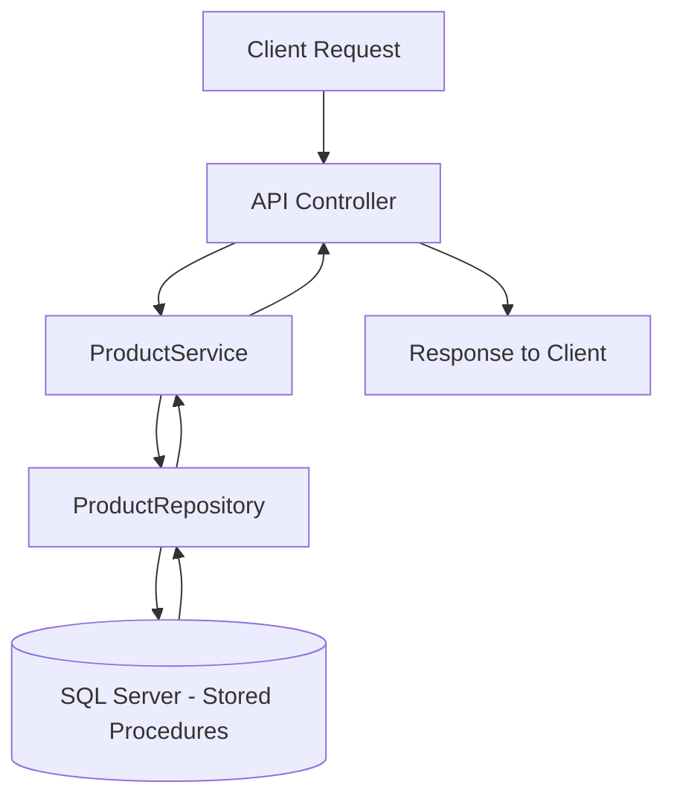
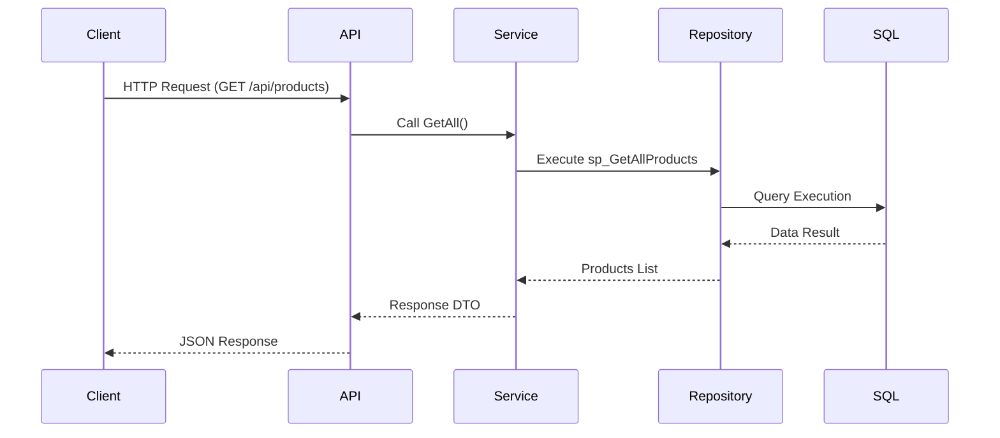

# 🧩 SCIProducts API (.NET 8)

This project is a **RESTful API** built with **.NET 8**, **C#**, and **SQL Server** to manage products.  
It follows a **Clean Architecture** approach with layered separation between **Domain**, **Application**, **Infrastructure**, and **API**.

---

## 🚀 Project Overview

**Solution name:** `SCITest`  
**Main API project:** `SCIProducts.API`  
**Database:** Microsoft SQL Server  
**ORM / Data access:** ADO.NET with stored procedures  
**Testing framework:** xUnit + Moq + FluentAssertions  
**Logging:** Microsoft.Extensions.Logging

---

## 🗂️ Solution Structure

```
SCITest/
│
├── SCIProducts.Domain/           # Entities and domain models
├── SCIProducts.Application/      # Application logic and service layer
├── SCIProducts.Infrastructure/   # Data access, repositories, and SQL connections
├── SCIProducts.API/              # Web API entry point (controllers)
└── SCIProducts.Tests/            # Unit tests project (xUnit)
```

---

## 🧰 Requirements

Before running the project, make sure you have the following installed:

- ✅ [.NET 8 SDK](https://dotnet.microsoft.com/download)
- ✅ [SQL Server 2019+](https://www.microsoft.com/en-us/sql-server/sql-server-downloads)
- ✅ [SQL Server Management Studio (SSMS)](https://learn.microsoft.com/en-us/sql/ssms/download-sql-server-management-studio-ssms)
- ✅ [Visual Studio 2022 or newer](https://visualstudio.microsoft.com/)
- ✅ Git

---

## ⚙️ Database Setup

1. Open **SQL Server Management Studio (SSMS)**.
2. Connect to your SQL Server instance.
3. In the repository, navigate to:

   ```
   /Database/
   ```

   Inside this folder you’ll find:
   - `CreateDatabase.sql` → creates the database and tables.
   - `StoredProcedures.sql` → contains all stored procedures required by the API.

4. Execute these scripts **in order**:
   - First: `CreateDatabase.sql`
   - Then: `StoredProcedures.sql`

5. Verify the creation of:
   - Database: `SCIProductsDB`
   - Tables: `Products` (and related entities)
   - Stored procedures such as:
     - `sp_GetAllProducts`
     - `sp_GetProductById`
     - `sp_AddProduct`
     - `sp_UpdateProduct`
     - `sp_DeleteProduct`

---

## 🖥️ Running the API

1. Open the solution in **Visual Studio 2022**.
2. Set `SCIProducts.API` as the **startup project**.
3. Open `appsettings.json` and verify the database connection string:

   ```json
   "ConnectionStrings": {
     "DefaultConnection": "Server=YOUR_SERVER_NAME;Database=SCIProductsDB;Trusted_Connection=True;TrustServerCertificate=True;"
   }
   ```

4. Build the solution:
   ```bash
   dotnet build
   ```

5. Run the API:
   ```bash
   dotnet run --project SCIProducts.API
   ```

6. Open your browser and navigate to:
   ```
   https://localhost:7044/swagger
   ```
   or
   ```
   http://localhost:5044/swagger
   ```
   to access Swagger UI and test all endpoints.

---

## 🧪 Running Unit Tests

1. In Visual Studio, open **Test Explorer** (`Ctrl+E, T`).
2. Select **Run All Tests**.
3. Alternatively, you can use the CLI:
   ```bash
   dotnet test
   ```
4. Make sure the test project references are correctly restored and that `xunit.runner.visualstudio` is installed.

---

## 🪵 Logging

All application and repository logs are configured using `ILogger<T>` and stored in the **console output** while debugging.  
For production or advanced scenarios, you can configure file or cloud logging in `Program.cs`.

---

## 🧭 System Flow (Mermaid Diagram)



## 🔁 API Flow Diagram


---

## 🧱 Technologies Used

- **.NET 8 (C#)**
- **SQL Server**
- **ADO.NET + Stored Procedures**
- **xUnit + Moq + FluentAssertions**
- **Microsoft.Extensions.Logging**
- **Swagger (Swashbuckle)**

---

## 📄 License

This project is for educational and technical evaluation purposes.

---

**Author:** Yesica Andrea Pulido  
**Project:** SCIProducts API – .NET 8 Test  
**Date:** 2025
